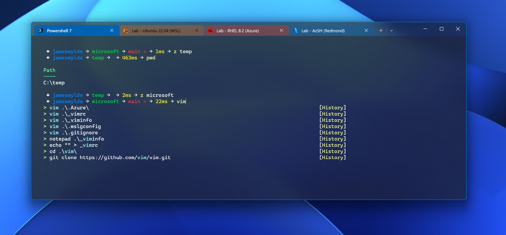
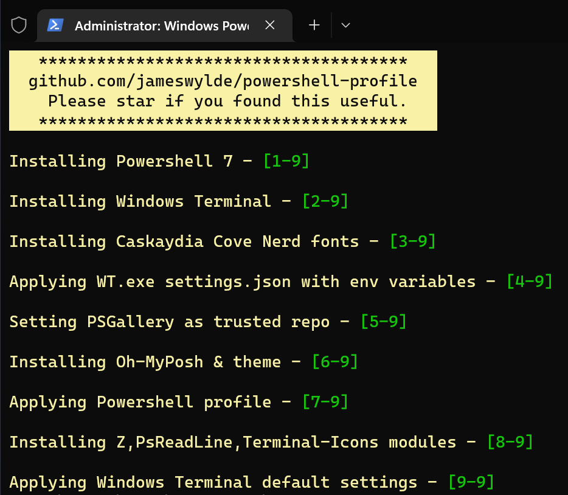

**Script built to automate setting up my Windows Terminal and Powershell profile on new machines.**




- Install Windows Terminal (if not already installed) and my WT config & theme
- Install Powershell 7 (if not already installed)
- Install Oh-My-Posh & apply my OMP theme (seen above) 
- Install PS modules: *PSReadline, Z (stores and scans ```cd``` history to hop directories), Terminal-Icons*
- Install my Powershell profile (Oh-My-Posh config, git shortcuts, autocompletes, psreadline config) & backup
- Install required glyphed fonts (*Caskaydia Cove Nerd Mono*)

Usage:

```.\install.ps1```



*Progress is not displayed - errors will be thrown if any occur.*
