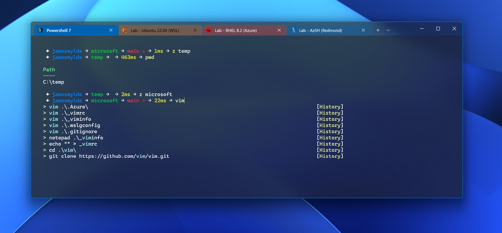

# Quick start Windows Terminal, Powershell 7, Oh-My-Posh, and more...

**Quick start PS7 setup...**



## About

I put this repo together as I'm endlessly jumping machines - I have a private repo of this script which installs all the modules I use and an endless list of winget installs so I'm up and running quickly on a new machine. Please fork aware and add all the winget installs and modules you might need to get up and running quickly on new machines.

## ✨ Features

- **Windows Terminal** with custom configuration and themes
- **Oh-My-Posh** for a prettier prompt - with my theme wylde.omp.json
- **Enhanced Modules**: PSReadLine, Terminal-Icons, Z (directory jumping)
- **Nerd Fonts** for icon and glyph support
- **Smart Completion**: Bracket pairing, quote handling, argument cycling
- **Predictive IntelliSense** with history-based suggestions

## 🚀 Quick Start

### Prerequisites
- **Windows 10/11**
- **PowerShell 7.0 or higher**
- **Administrator privileges**

### Installation

1. **Download or clone this repository**
2. **Run PowerShell 7 as Administrator**
3. **Execute the installer:**

```powershell
.\install.ps1
```

### Installation Options

| Parameter | Description | Default |
|-----------|-------------|---------|
| `-SkipModules` | Skip PowerShell module installation | $false |


### Applications
- **Windows Terminal**
- **Oh-My-Posh** - pretty prompt
- **WinGet** - package manager

### PowerShell Modules
- **PSReadLine** - Enhanced command line editing
- **Terminal-Icons** - File and folder icons
- **Z** - Directory jumping based on frecency


### File Locations
- **Assets**: `%USERPROFILE%\AppData\Local\PowerShellTerminalAssets`
- **Profiles**: `%USERPROFILE%\Documents\PowerShell\Microsoft.PowerShell_profile.ps1`
- **Terminal Config**: `%LOCALAPPDATA%\Packages\Microsoft.WindowsTerminal_*\LocalState\settings.json`
- **Oh-My-Posh Theme**: `%LOCALAPPDATA%\Programs\oh-my-posh\themes\wylde.omp.json`


## Forking
As mentioned - this is a template script, I encourage you to fork this repo and add your own modules and winget installs. Add your functions to the script and add, for example:

```powershell
    $steps = @(
        { Install-YourModule -Name 'YourModuleName' -Version '1.0.0' }
        { Install-WinGetPackage -Package 'Your.Package.Name' },
        { Install-YourCustomFunction }
    )
```


## 🗑️ Uninstalling

### Remove Configuration Only
```powershell
.\scripts\uninstall.ps1
```

### Remove Everything (including applications)
```powershell
.\scripts\uninstall.ps1 -RemoveApplications
```

The uninstaller:
- Restores original PowerShell profile (if backup exists)
- Removes custom terminal configuration
- Cleans up script assets
- Optionally removes installed applications


